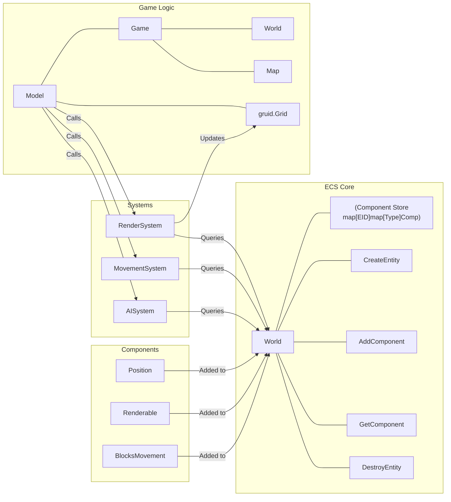

# ECS Implementation Plan for Roguelike Project

This document outlines the plan for implementing an Entity-Component-System (ECS) architecture in the `roguelike-gruid-project`.

## Design Choices

- **Entity ID:** `int`
- **Component Storage:** Central map: `map[EntityID]map[reflect.Type]interface{}`
- **System Access:** Systems query the central map.
- **Initial Components:** `Position`, `Renderable`, `BlocksMovement`

## Implementation Phases

### Phase 1: Core ECS Structure

1. **Define Core Types:**

   - Create `ecs.go`.
   - Define `EntityID` type (`type EntityID int`).
   - Define `Component` interface (optional) or use `interface{}`.
   - Define `World` struct containing:
     - `entities map[EntityID]map[reflect.Type]interface{}`
     - `nextEntityID EntityID`

2. **Implement World Methods:**

   - `NewWorld() *World`
   - `CreateEntity() EntityID`
   - `AddComponent(id EntityID, component interface{})`
   - `GetComponent(id EntityID, compType reflect.Type) (interface{}, bool)`
   - `HasComponent(id EntityID, compType reflect.Type) bool`
   - `RemoveComponent(id EntityID, compType reflect.Type)`
   - `DestroyEntity(id EntityID)`

3. **Define Initial Components:**
   - Create `components.go`.
   - Define structs:
     - `Position{ Point gruid.Point }`
     - `Renderable{ Glyph rune; Color gruid.Color }`
     - `BlocksMovement{}` (Tag component)

### Phase 2: Integration

4. **Integrate World into Game:**

   - Add `ecs *World` field to the `game` struct in `game.go`.
   - Initialize the `World` during game creation.

5. **Create Player Entity:**
   - Use `World` methods in game initialization to create the player entity and add `Position`, `Renderable`, etc.

### Phase 3: Systems & Game Loop

6. **Define System Interface (Conceptual):**

   - (Optional) Define `System` interface: `type System interface { Update(ecs *World) }`

7. **Implement Initial Render System:**

   - Create `RenderSystem` (function or struct).
   - Query `World` for entities with `Position` and `Renderable`.
   - Draw entities onto the `model`'s `gruid.Grid`.

8. **Modify Game Loop (`model.Update` / `model.Draw`):**
   - `model.Draw`: Clear grid, call `RenderSystem`, return grid.
   - `model.Update`: Placeholder for future system calls (Movement, AI).

## Visualization

## Next Steps

- Implement more components (e.g., `Health`, `CombatStats`, `AI`).
- Implement systems for movement, AI, combat, etc.
- Refine system query mechanisms if needed.
- Handle entity destruction and cleanup.
