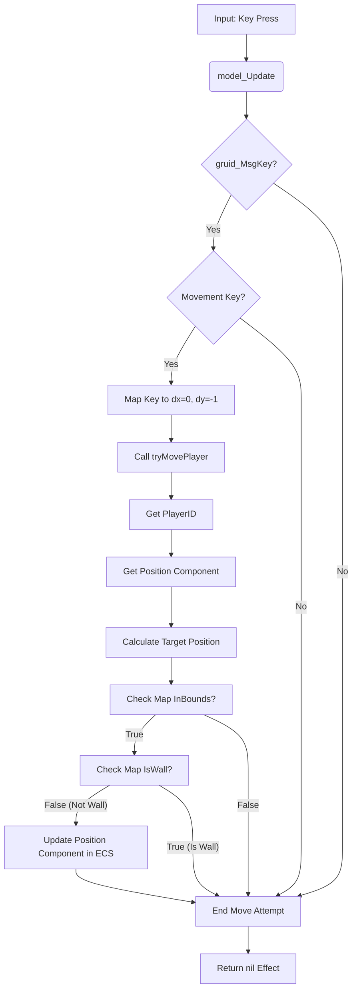

# RFC 001: Player Movement Implementation

**Date:** 2025-03-31

**Status:** Proposed

## 1. Overview

This document outlines the plan for implementing basic 8-directional player movement in the Go roguelike project. The player will control movement using Arrow keys and vi-keys (`hjkl/yubn`). Movement into walls will be ignored, and each valid move will constitute a game turn.

## 2. Requirements

- **Input:** Arrow keys and `hjkl/yubn` keys.
- **Movement:** 8 directions (orthogonal + diagonal).
- **Collision:** Prevent movement into wall tiles (`TileWall`). Ignore invalid moves.
- **Turns:** Each valid player move represents one game turn.

## 3. Proposed Solution: Helper Function Approach

The chosen approach involves handling key input within the existing `model.Update` function and delegating the core movement logic (validation, ECS update) to a new helper function, `tryMovePlayer`.

**Reasoning:** This balances simplicity for initial implementation with better code organization compared to putting all logic directly in `model.Update`. It avoids the immediate overhead of a full ECS system while keeping the movement logic contained.

## 4. Detailed Implementation Steps

1. **Update `main.go` (Confirmation):**

   - Ensure `g.PlayerID` is assigned after entity creation:

     ```go
     // In main() after g := &game{...}
     playerID := g.ecs.CreateEntity()
     g.PlayerID = playerID // Ensure this assignment happens
     // ... add components using playerID
     ```

2. **Modify `model.go` - `model.Update` Function:**

   - Add a `case gruid.MsgKey:` block.
   - Map keys to `dx, dy` values:
     - `gruid.KeyArrowLeft`, `gruid.KeyH`: `dx = -1`
     - `gruid.KeyArrowRight`, `gruid.KeyL`: `dx = 1`
     - `gruid.KeyArrowUp`, `gruid.KeyK`: `dy = -1`
     - `gruid.KeyArrowDown`, `gruid.KeyJ`: `dy = 1`
     - `gruid.KeyY`: `dx = -1; dy = -1`
     - `gruid.KeyU`: `dx = 1; dy = -1`
     - `gruid.KeyB`: `dx = -1; dy = 1`
     - `gruid.KeyN`: `dx = 1; dy = 1`
   - If `dx != 0 || dy != 0`, call `m.tryMovePlayer(dx, dy)`.

3. **Add `model.go` - `tryMovePlayer` Helper Function:**
   - Signature: `func (m *model) tryMovePlayer(dx, dy int)`
   - Get Player ID: `playerID := m.game.PlayerID`
   - Get Position Component: `posComp, ok := m.game.ecs.GetComponent(playerID, Position{})` (handle `!ok`)
   - Calculate Target Position: `targetPos := currentPos.Add(gruid.Point{X: dx, Y: dy})`
   - Validate Move: `if m.game.Map.InBounds(targetPos) && !m.game.Map.IsWall(targetPos)`
   - Update Position (if valid): `m.game.ecs.AddComponent(playerID, Position{Point: targetPos})`

## 5. Data Flow



## 6. Assumptions & Trade-offs

- Assumes `g.PlayerID` is correctly set in `main.go`.
- Assumes player always has `Position`.
- Prioritizes simpler implementation now over a full ECS system for movement.
- Only handles wall collisions; entity collisions are for later.
